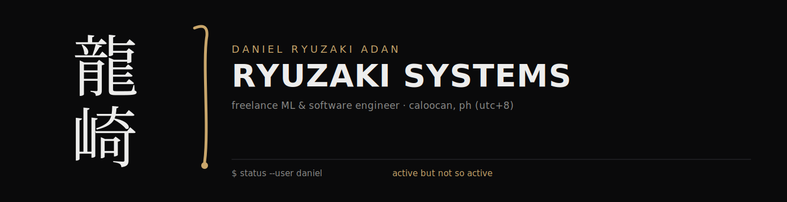
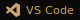

<picture>
  <source media="(prefers-color-scheme: dark)" srcset="./assets/banner-dark.svg">
  <source media="(prefers-color-scheme: light)" srcset="./assets/banner-light.svg">
  
</picture>

 

 

> *I am only commit-productive during project acquisition.*

Freelance ML & software engineer working under **Soli Deo Code**. Full-stack
when the project calls for it — React or Flutter on the front, Next.js or a
hand-rolled backend underneath, ML where it earns its place.

 

### `$ skills --list`

**web · frontend**

**mobile · embedded**

**languages**

**backend · data**

**tools**

 

### `$ ls ./recent-projects`

 

SOLI DEO CODE

